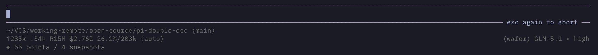

<div align="center">

# ⏏️ pi-double-esc

**Prevent accidental Escape aborts in [pi](https://github.com/earendil-works/pi-coding-agent)**

_Require a second Escape press within 500ms to confirm any abort action._

[](https://github.com/earendil-works/pi-coding-agent)
[](./LICENSE)



</div>

---

## What It Does

When the LLM is streaming a response:

- **First Escape press**: Shows an `esc again to abort` hint on the editor border — does **not** abort
- **Second Escape** within the debounce window: Actually aborts the streaming response
- If the debounce window expires, the hint clears and escape resets

When the LLM is **not** streaming, Escape works normally (immediate) — no debounce applied. Autocomplete dismissal always works on a single Escape.

## Installation

### Option 1: Install via pi package (Recommended)

Install directly from GitHub as a pi package:

```bash
pi install https://github.com/monotykamary/pi-double-esc@main
```

Or add to your `settings.json`:

```json
{
  "packages": [
    "https://github.com/monotykamary/pi-double-esc@main"
  ]
}
```

### Option 2: Global Installation

Copy the extension to pi's global extensions directory:

```bash
cp double-esc.ts ~/.pi/agent/extensions/
```

### Option 3: Project-Local Installation

Copy to your project's `.pi/extensions/` directory:

```bash
mkdir -p .pi/extensions
cp double-esc.ts .pi/extensions/
```

### Option 4: Quick Test

```bash
pi -e ./double-esc.ts
```

## Configuration

Set the `PI_DOUBLE_ESC_MS` environment variable to change the debounce timeout (default: 1500ms):

```bash
PI_DOUBLE_ESC_MS=2000 pi
```

## How It Works

The extension decorates pi's current editor instead of replacing it:

1. On each `session_start`, it reads the current editor factory with `ctx.ui.getEditorComponent()`.
2. It creates that editor, or a `CustomEditor` when no extension installed one earlier.
3. It decorates the editor's input and render methods with double-Escape behavior.
4. While streaming, the first Escape shows a visual hint and starts a debounce timer.
5. A second Escape within the window passes Escape to the current editor, which aborts the response.
6. Any other keypress or timeout expiry dismisses the hint.

This design preserves behavior from editor extensions loaded before `pi-double-esc`. The debounce logic lives in `src/double-esc-logic.ts` as pure functions for testability.

## Development

```bash
npm install          # install dev dependencies
npm test            # run tests
npm run typecheck   # type check
npm run lint:dead   # check for unused exports
```

## License

MIT
